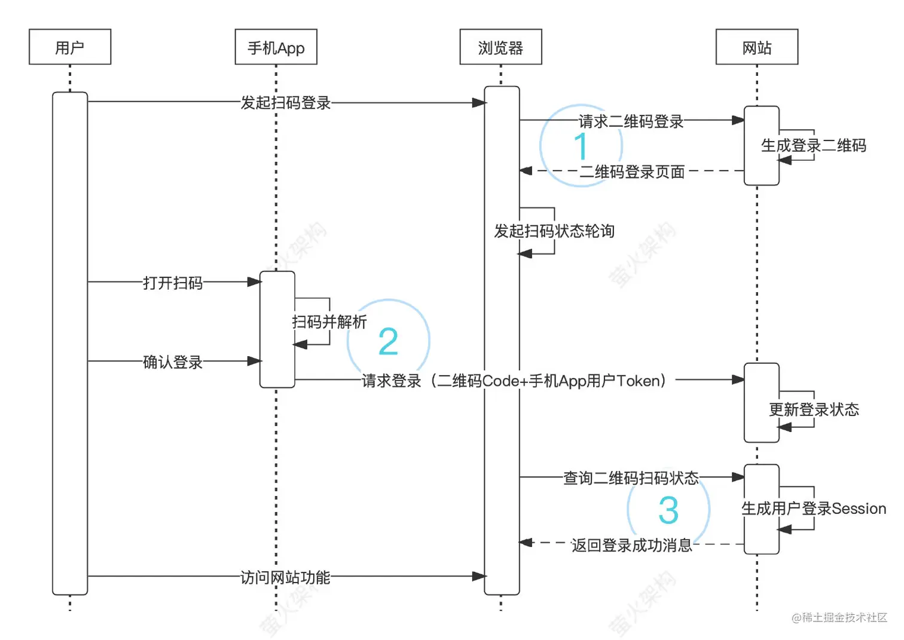

## 有一个1000 - 10000 的数据列表，不使用分页的形式，如何实现部分渲染(实际问懒加载)

#### 定高虚拟列表实现思路：
- 初始化的时候只渲染 2 个屏幕的数据。（多渲染 1 屏防止向下滑动出现空白）
- 向下滚动的时候，根据是否滚动到底部，重新加载数据。
- 如果没滚动到底部，计算显示区域需要显示的数据索引，可以前后都多留 1 屏的数据。
- 然后还得计算顶部块和底部块的高度，用于撑开 list 的高度，方便滚动。（这里你也可以直接设置 list 的高度，然后利用 translateY 向下移动，显示出想要渲染的数据，这种方式也行，总之都是撑开 list 的高度）

#### 非定高虚拟列表实现思路
- 需要将所有的数据一次性获取，这里暂不考虑无限滚动
- 首先明确一点要想滚动，必须把 list 高度撑起来。在定高虚拟列表里，因为 item 高度固定，所以很容易计算各种高度。现在 每个 item 高度不固定，直接算没这么简单。
- 我们可以假设每个 item 有个平均高度（可以根据实际的 item 平均估算一下）itemHeight。
- 初始化的时候按照这个 itemHeight 显示2屏的初始数据。显示完之后，把每个 item 的高度信息都缓存起来（后面需要利用这实际 item 的高度计算 beginIndex，以及不断的更新item 的平均高度 itemHeight）。
- 向下滚动的时候（默认滚动的距离不会很大，不会超过1屏），可以根据缓存起来的 item 高度（累计求和），与滚动的高度比较，从而计算出 beginIndex。（到这一步，beginIndex 计算是正确的，因为是根据实际 item 的高度比较计算的，而不是根据平均 itemHeight 计算）
- 然后计算 endIndex、endHeight 的时候，就要用到 item 的平均itemHeight。（实际上这两个计算的都不是很准确但是不影响滚动就行，因为那个 item 的平均 itemHeight,在不停的接近真实值，如果滚动到底的话，后续的向上、向下滚动计算的值就都是准确的）

## 扫码登录的实现思路
https://juejin.cn/post/7056544865647067172

- 1、用户发起二维码登录：此时网站会先生成一个二维码，同时把这个二维码对应的标识保存起来，以便跟踪二维码的扫码状态，然后将二维码页面返回到浏览器中；浏览器先展示这个二维码，再按照Javascript脚本的指示发起扫码状态的轮询。所谓轮询就是浏览器每隔几秒调用网站的API查询二维码的扫码登录结果，查询时携带二维码的标识。有的文章说这里可以使用WebSocket，虽然WebSocket响应比较及时，但是从兼容性和复杂度考虑，大部分方案还是会选择轮询或者长轮询，毕竟此时通信稍微延迟下也没多大关系。

- 2、用户扫码确认登录：用户打开手机App，使用App自带的扫码功能，扫描浏览器中展现的二维码，然后App提取出二维码中的登录信息，显示登录确认的页面，这个页面可以是App的Native页面，也可以是远程H5页面，这里采用Native页面，用户点击确认或者同意按钮后，App将二维码信息和当前用户的Token一起提交到网站API，网站API确认用户Token有效后，更新在步骤1中创建的二维码标识的状态为“确认登录”，同时绑定当前用户。

- 3、网站验证登录成功：在步骤1中，二维码登录页面启动了一个扫码状态的轮询，如果用户已经“确认登录”，则轮询访问网站API时，网站会生成二维码绑定用户的登录Session，然后向前端返回登录成功消息。这里登录状态维护是采用的Session机制，也可以换成其它的机制，比如JWT。
为了保证登录的安全，有必要采取一些安全措施，可能包括以下若干方法：

对二维码承载的信息按照某种规则进行处理，App可以在扫码时进行验证，避免任何扫码都去请求登录；

对二维码设置一个过期时间，过期就自动删除，这样使其占用的资源保持在合理范围之内；

限制二维码只能使用一次，防止重放攻击；

二维码使用足够长的随机性字符串，防止被恶意穷举占用；

使用HTTPS传输，保护登录数据不被窃听和篡改。

## 网络请求乱序，后续提问乱序的影响，工作中有遇到这样的问题吗
https://blog.csdn.net/weixin_44131922/article/details/138343547

## 如何在网络中下载一个大的文件，并且不影响当前页面的正常展示和性能等

